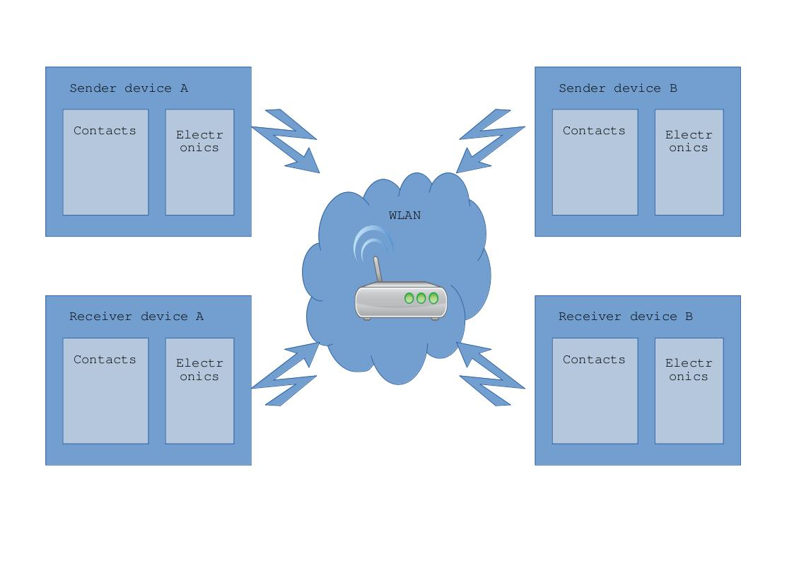

# Fips
Fips, mobile communication device for deafblind people

## Motivation
The biggest problem for deafblind people is social isolation.
Ofcourse they can read books printed in Braille or write a letter using a Braille keyboard, but this is not the same as talking with somebody.
## The aim of the project
is to provide a technical solution which allows deafblind people to talk with somebody as similar to a normal talk as possible. 
## System architecture - Top Level

## How to build

1. get the hardware components from the partlist (see hardware folder)
2. Generate the 3D printing files for an available 3D printer from the .stl files in the 3D folder
3. Print the components (3 parts of the aktuators are needed 5 times)
4. Clue the magnets on the magnet holder and place put them in the coil holder so that the magnet holder can move freely up and down in the coil holder
5. Clip the bootom of the coils holder on to the coil holder
6. Wind 500 windings of the cooper wire on to each coil holder so thet there are two 5cm long wires outside to later electrically connect the winding
7. Remove the isolation half a centimeter from the ends of the wires, test the functionality with the battery and mark the polarity where the magnet moves the magnet holder upwards
8. Mount the charging electronics, the battery, the actuators, the switches and the microcontroller in the housing
9. Connect the electronic components and the driver IC acording to the schematic (see hardware folder)
10. Fix the parts with screws and put the housing together and fix it with the screws
11. Download the SW on the microcontroller
12. Test the functionality
    
