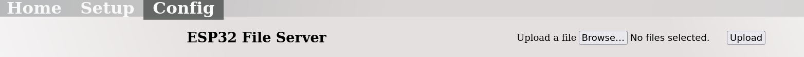

## Latest ready to use binaries to flash on a ESP32S2 mini microcontroller board

### Flashen der Software (Programmierung des Mikrocontrollers)
Das Flashen der Software besteht aus mehreren Schritten.
- Das Flashen des Fips Programms für den ESP32, DeafBlind.bin
- Das Flashen des bootloaders, bootloader.bin
- Das Flashen der partition table, partition-table.bin
- (optional) Das Flashen von ota_data_inbitial.bin 
- Das Flashen der Dateien für die Webseiten auf dem ESP32
 
Zuerst müssen aber die Dateien vom gitghub Server auf den lokalen Computer kopiert werden.
Dazu erst einen Ordner auf dem lokalen Computer anlegen, in dem alle notwendigen Dateien abgelegt werden sollen. 
Dann auf dieser Seite die Datei DeafBlind.bin anklicken. Dann oben rechts auf Download klicken und den Ordner auf dem lokalen Computer auswählen.
Wenn die Datei in den Download Ordner gespeichert wurde, die Datei von hier in den gewünschten Ordner ziehen.
Als zweites und drittes mit den Dateien bootloader.bin und partition-table.bin genauso verfahren. 

Zum Flashen des Fips Programms braucht man ein spezielles Flash Tool der Fa. Espressif. Es ist ein Python Programm und heisst esptool.py.
Die Installationsanweisung ist unter folgendem Link zu finden
`https://docs.espressif.com/projects/esptool/en/latest/esp32/installation.html#installation`

Am einfachsten ist es, das esptool im gleichen Ordner zu installieren, wie die anderen Dateien, dann braucht man keine expliziten Pfadangaben.
Wir empfehlen, unser Script zu verwenden oder anzupassen, wenn die Dateien in anderen Ordnern liegen.

Wenn man keinen Namen für den USB Port angibt, sucht das Programm selbständig nach einem verbundenen Port.
Sollte das nicht funktionieren, den port explizit mit der Option --port xyz angeben. Unter Windows heisst der port COMx, wobei x eine Zahl ist.
Unter Linux heisst der port /dev/ttyACMx, wobei x wieder eine Zahl ist. 

```
python3 esptool.py --chip esp32s2 -b 460800 --before=default_reset --after=hard_reset write_flash --flash_mode dio --flash_freq 80m --flash_size 4MB 0x1000 bootloader.bin 0x10000 DeafBlind.bin 0x8000 partition-table.bin 0xe000 ota_data_initial.bin
```
Der Name des USB Port am Computer heisst u.U. anders als hier hinter der Option --port angegeben. Unter folgendem Link findet man eine Anleitung.

**Linux**
```
--port /dev/ttyACM0
```

**Windows** 
```
--port com4
```
#### Flashen der Dateien für die Webseiten
Nach dem Flashen des Programms "DeafBlind.bin" kann das Programm mit einem Reset des ESP32 gestartet werden. Dabei erstellt das Programm einen WLAN Access Point mit der IP Adresse 192.168.4.1 und der WLAN ssid DB.

Zuerst muss man das WLAN wechseln, aus dem eigenen WLAN in das WLAN, das der ESP32 aufgespannt hat. Der eigene Computer zeigt unter WLAN Einstellungen die sichtbaren WLAN Netze an. Man deaktiviert das bisherige WLAN und meldet sich bei dem WLAN mit dem Namen DB neu an.

Die Zugangsdaten sind:
- Password: `   `  

Der Aufruf der initialen Webseite erfolgt in einem beliebigen Webbrowser mit der Adresszeile ```https://192.168.4.1/index.html```.
Man sieht daqnn folgende Seite: 


Hier kann man man über den `BROWSE` Tab alle notwendigen Dateien laden. 

**Liste der Dateien**

#### Konfiguration für das eigene lokale WLAN
Nach dem man alle o.g. Dateien hochgeladen hat, sollte man den ESP32 erneut resettten, um alle Änderungen wirksam zu machen.

Erneuter Aufruf mit der Adresszeile ```https://192.168.4.1/index.html``` zeigt jetzt eine neue Seite:


Mit dem Tab `SETUP` wechseln wir zur Setup Seite. In dem Menu xyz setzen wir unsere eigenen lokalten WLAN Einstellungen oder das WLAN, in dem wir uns gerade befinden und das Gerät nutzen wollen.

Die Schaltflächen `Speichern` und `Senden` nacheinander anklicken, um die Änderungen zu übernehmen. Danach ist das Gerät betriebsbereit.


---
alt
---

Um die Dateien für die Webseiten zu laden, verwendet man die `CONFIG` Seite auf der Webseite des Programms.

*Referenz zur Beschreibung wie man auf die Webseite kommmt*


Klicken auf "CONFIG" in der Menuzeile führt zur CONFIG-Seite.



Hier kann man man über den `BROWSE` Tab alle notwendigen Dateien laden. 

**Liste der Dateien**
