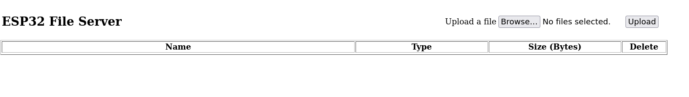

## Latest ready to use binaries to flash on a ESP32S2 mini microcontroller board
- DeafBlind.bin
- bootloader.bin
- partition-table.bin
- (optional) ota_data_initial.bin 

## Beschreibung für das Flashen der Software (Programmierung des Mikrocontrollers)
Das Flashen der Software besteht aus mehreren Schritten.
- Das Flashen des Fips Programms für den ESP32, DeafBlind.bin
- Das Flashen des bootloaders, bootloader.bin
- Das Flashen der partition table, partition-table.bin
- (optional) Das Flashen von ota_data_inbitial.bin 
- Das Flashen der Dateien für die Webseiten auf dem ESP32
 
Zuerst müssen aber die Dateien vom github Server auf den lokalen Computer kopiert werden.
Dazu erst einen Ordner auf dem lokalen Computer anlegen, in dem alle notwendigen Dateien abgelegt werden sollen. 
Dann auf dieser Seite die Datei DeafBlind.bin anklicken. Dann oben rechts auf Download klicken und den Ordner auf dem lokalen Computer auswählen.
Wenn die Datei in den Download Ordner gespeichert wurde, die Datei von hier in den gewünschten Ordner ziehen.
Als zweites und drittes mit den Dateien bootloader.bin und partition-table.bin genauso verfahren. 

Zum Flashen des Fips Programms braucht man ein spezielles Flash Tool der Fa. Espressif. Es ist ein Python Programm und heisst esptool.py.
Die Installationsanweisung ist unter folgendem Link zu finden
`https://docs.espressif.com/projects/esptool/en/latest/esp32/installation.html#installation`

Bei Windows braucht man noch den Python Interpreter, damit sehen die Installationsschritte wie folgt aus.

1. Python installieren. Den Installer findet man unter `https://www.python.org/downloads/windows/`. Bei der Installation das Häkchen für die Anpassung der `PATH` Variablen setzen.
2. Das "esptool" installieren. Dazu mit `CMD` ein Terminal Fenster unter Windows aufmachen und folgenden Befehl eingeben: ```pip install esptool```.   

(Wir empfehlen, unser Script `fips-esptool` zu verwenden oder anzupassen, wenn die Dateien in anderen Ordnern liegen.)
```
python3 -m esptool --chip esp32s2 -b 460800 --before=default_reset --after=hard_reset write_flash --flash_mode dio --flash_freq 80m --flash_size 4MB 0x1000 bootloader.bin 0x10000 DeafBlind.bin 0x8000 partition-table.bin
```
oder optional mit ota - over the air - Programmierung: 

```
python3 -m esptool --chip esp32s2 -b 460800 --before=default_reset --after=hard_reset write_flash --flash_mode dio --flash_freq 80m --flash_size 4MB 0x1000 bootloader.bin 0x10000 DeafBlind.bin 0x8000 partition-table.bin 0xe000 ota_data_initial.bin
```

> Unter Linux ist Python standardmässig bereits installiert. Hier muss nur noch das esptool mit dem gleichen Kommando wie oben installiert werden. Eine > mögliche Fehlerquelle ist noch die installierte Python version, sie sollte grösser V3.7 sein. Die installierte Version erhält man mit dem Aufruf von `python --version` in der Kommandozeile. Wenn eine ältere Python Version installiert ist, kann man auf eine aktuelle Version upgraden, es sein denn.man braucht die ältere Version aus anderen Gründen. Ist das der Fall, gibt es kein Standard Vorgehen.  

Das Programm sucht automatisch nach dem richtigen USB Port. Wenn es den nicht findet und eine entsprechende Fehlermeldung ausgibt, kann man den Port explizit als zusätzliche Option `--port xyz` angeben. Unter Windows heisst der port COMx, wobei x eine Zahl ist. Unter Linux heisst der port /dev/ttyACMx, wobei x wieder eine Zahl ist. 

**Linux**
```
--port /dev/ttyACM0
```

**Windows** 
```
--port com4
```
#### Flashen der Dateien für die Webseiten
Nach dem Flashen des Programms "DeafBlind.bin" kann das Programm mit einem Reset des ESP32 gestartet werden. Dabei erstellt das Programm einen WLAN Access Point mit der IP Adresse 192.168.4.1 und der WLAN ssid DB.

Zuerst muss man das WLAN wechseln, aus dem eigenen WLAN in das WLAN, das der ESP32 aufgespannt hat. Der eigene Computer zeigt unter WLAN Einstellungen die sichtbaren WLAN Netze an. Man deaktiviert das bisherige WLAN und meldet sich bei dem WLAN mit dem Namen DB neu an.

Die Zugangsdaten sind:
- ssid: DB
- Password: 123456789  

Der Aufruf der initialen Webseite erfolgt in einem beliebigen Webbrowser mit der Adresszeile ```https://192.168.4.1/index.html```.

> Der Webbrowser meldet eine unsichere Seite. Bestätigen, dass man trotzdem mit der Seite verbunden werden möchte.
> ( Es ist unser eigener Server, also alles in Ordnung ) 
Man sieht dann folgende Seite: 



Hier kann man man über den `BROWSE` Tab die u.g. Dateien auswählen und durch Anklicken des `UPLOAD` Felds laden. 

Vorher noch die Dateien für die Webseiten in einen Ordner auf dem eigenen Rechner laden. Die Dateien finden sich auf der Github Seite in folgendem Ordner:
```
software/DeafBlind/webpages
```

**Liste der Dateien**
- Home.html
- Home.js
- Setup.html
- Setup.js
- Config.js
- DHSHMenu.css
- DHSHMenu.js
- DHSsocket.js
- ILGH16XB.FNT
- ILGH24XB.FNT
- ILGH32XB.FNT
- LATIN32B.FNT
- index.html

Die Datei index.html als letztes laden, danach ändert sich die Webseite.

#### Konfiguration für das eigene lokale WLAN
Nach dem man alle o.g. Dateien hochgeladen hat, sollte man den ESP32 erneut resettten, um alle Änderungen wirksam zu machen.

Erneuter Aufruf mit der Adresszeile ```http://192.168.4.1``` zeigt jetzt eine neue Seite:


Mit dem Tab `SETUP` wechseln wir zur Setup Seite. In dem Feld `WLAN Credentials` setzen wir unsere eigenen lokalen WLAN Einstellungen oder das WLAN, in dem wir uns gerade befinden und das Gerät nutzen wollen mit `IP-Adresse-des-Routers,WLAN-Passwort` also z.B. `192.168.1.0,a6bH!vK#`.

Die Schaltflächen `Senden` und `Speichern` nacheinander anklicken, um die Änderungen zu übernehmen und abzuspeichern. Danach ist das Gerät betriebsbereit und meldet sich selbständig im lokalen Netzwerk an.

