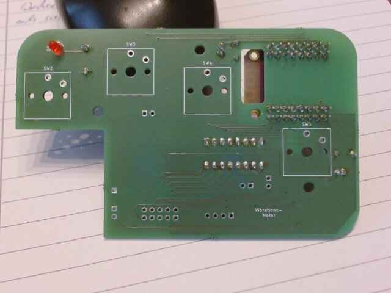
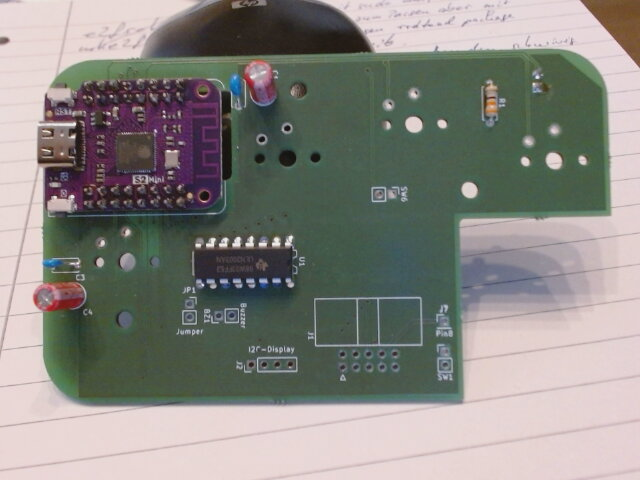

## Hardware
We have a sender and a receiver device.

The schematics are fips-sender.pdf and fips-receiver.pdf.

The sender device has a printed circuit board for easier connection of parts.

The top side of the board holds the keys and a LED (keys not shown in the picture 

The bottom side holds the ESP32 microcontroller board and some other components.   

